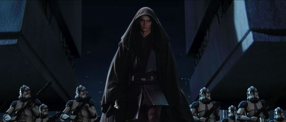
# Clone Wars Memory Game 

Welcome to the Clone Wars Memory Game, which is a themed remake of the popular Simon memory game from the 80's. However this game is all based upon the clone troopers from the 501st regiment from the Star Wars prequel films, and most notably 'Attack of the Clones'. and 'Revenge of the Sith' aswell as the animated series 'The Clone Wars'.

The Overall aim of this project is to have built a functional memory game that is enjoyable to play, utilising stunning imagery of the clone troopers and giving the whole game a very star wars feel compared to the original simon game, and one where star wars fans can have a laugh as well. 

## Live Site Images

## Contents

### 1.Purpose of The Game/ Value To User

### 2.Target Audience

### 3.User Stories

### 4.Web Design

### 5.Wire Frames

### 6.Website Walkthrough

### 7. Methods for creating the site 

### 8.Testing

### 9. Bugs

### 10. Deployment

## 1.Purpose of The Game/ Value To User
  [Go to the top](#table-of-contents)

The purpose of this game is to provide star wars fans a fun memory game that is similar to the 80's game Simon, but with the type of escapism that is typical of star wars films. In the form of stunning imagery, and subtle references that star wars fans know all too well while testing their memory ability.

The value to the user is definately evoking a positive emotional response, while being functional in testing memory ability. This is done by blaster sounds in the game that is from the prequel trilogy, the introduction and instructions that have been written as if a commander of the clone troopers (501st, Captain Rex) was saying them himself. And the overall imagery of the game highlighting the clone troopers including some images not every fan has seen before, as currently I have found no such game in existance that provides these aspects.

## 2.Target Audience
[Go to the top](#table-of-contents)

The target audience for the game is set for two age groups. 

- 30 - 40 years old. This is because this is the age group that would have seen the prequel films as they were released as kids and will be able to relate to the subtle references in the game.

- 10 - 20 years old. Due to the popularity of Disney+ that now includes the back catalogue of star wars material, people of this age can conviently rewatch all the animated series along with the films and immerse themself in the story behind the clone troopers.

## 3.User Stories
[Go to the top](#table-of-contents)

1. - I am presented with an enter screen with instructions to the game.

2. - I am presented with a random sequence of panel clicks.

3. - When I input a sequence of panel clicks, I see this repeated with 1 more addition to the sequence.

4. - That I hear a sound for each panel and hear the correct sound when a panel is clicked. And this sound is related to star wars.

5. - If I input the incorrect panel in the sequence, the game tells me so and repeats the pattern so I can try again

6. - I can clearly see how many clicks are in any given sequence

7. - I can play with accuracy mode engaged, which when a incorrect panel is clicked the game notifies me and restarts from the beginning of the game

8. - I am notified if I have Won the game

9. - I can give myfeedback/comments on what I think of the game

## 4.Web Design
[Go to the top](#table-of-contents)

This website has been designed with the following main principles:
- Simple and easy to navigate
- Ensuring no contrast issues between background and foreground content 
- Putting stunning Star Wars imagery of the clone troopers at the forefront of the design
- Including as much of a Star Wars feel as possible
- To create a game that genuinely tests mental ability which is fun
- To evoke a positive response from the User

Keeping the game quite minimilistic was key in my opinion, so the user could soley focus on the type of escapism that Star Wars is known for. A key aspect of this is the blaster sounds for the game, which i personally edited using music production software, pitch shifting and mastering plugins to achieve the sound. The original sound was the exact sound used for the Star Wars films 'Attack of the Clones' and 'Revenge Of The Sith'. Along with using unique imagery of the clone troopers I believe this game offers something that no other Star Wars memory games does (I have yet to come across one that does).

Within the game there are subtle hints to the Star Wars films that Star Wars fans will recognise. This comes in the form of the introduction for the game on the Enter page along with the instructions that are written as if it came out of the mouth of a clone commander or even Captain Rex himself.

The accuracy button although provides a good function, is also reference to the humour of storm troopers not being very accurate with their weapons. Although this game focus on the clones that preceeded them I thought it added a sense of humour to the game adding in evoking a positive emotional response from the user.

The alert messages also are written in classic clone commander fashion, and even quoted a famous quote from Grand Master Yoda if the user fails.

In conclusion with ensuring there is no issues with background and foreground content, I believe i have met the ideas and targets for this site in creating a site where mental ability can be functionally tested while immersing the user within the star wars universe!

## 5.Wire Frames
[Go to the top](#table-of-contents)

Below is the original wireframes created for the game, and as you can see I was able to stick quite close to the original intended plans, and i was pleased to be able to keep it simple for the user to be able to easily navigate the site and the game itself, but also injecting the star wars feel that was so important for this game.

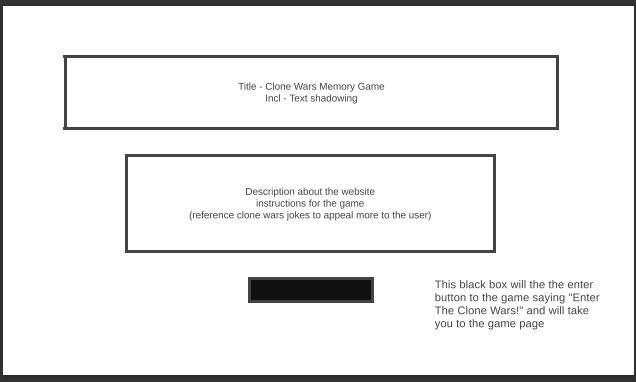

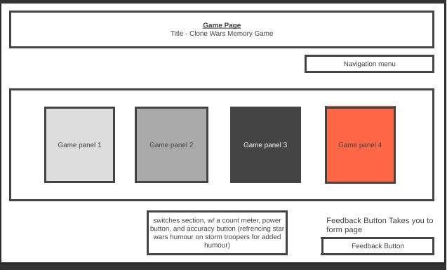

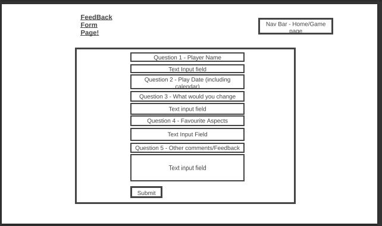

## 6.Website Walkthrough 
[Go to the top](#table-of-contents)

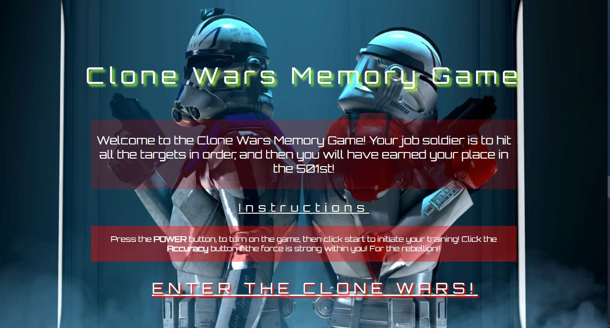
- This relates to user story 1.

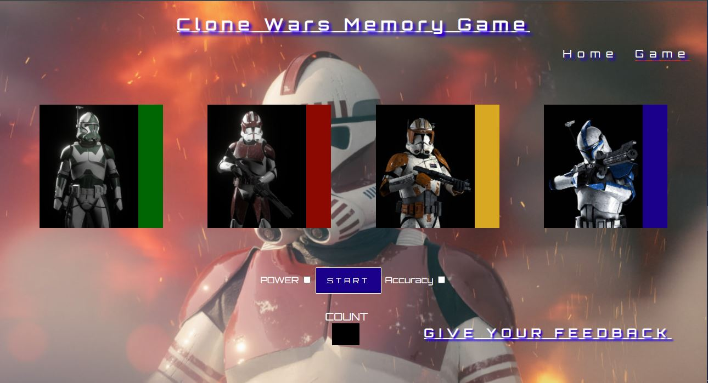
- This relates to user story 2 - 8, as they are to do with gameplay. Also if incorrect sequence is inputted by the user a alert box will pop up telling the user, also if the user wins a alert box will tell the user this as well.

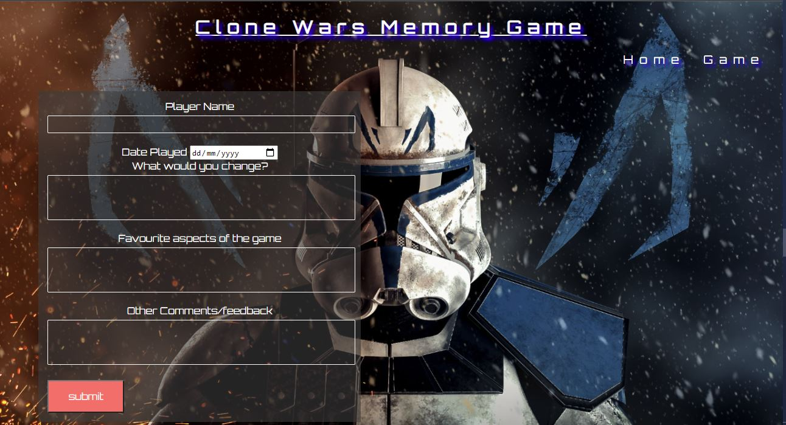

- This relates to user story 9.

## 7. Methods for creating the site 
[Go to the top](#table-of-contents)

* [HTML5](https://en.wikipedia.org/wiki/HTML) (was used for structuring and presenting content of the website)
* [CSS](https://en.wikipedia.org/wiki/CSS) (used for the styling of the content)
* [Javascript](https://en.wikipedia.org/wiki/JavaScript) (used for the game programming)
* [Google Fonts](https://fonts.google.com/) (used for all the font styling within the project)
* [Bootstrap](https://www.bootstrapcdn.com/) (used for the responsive code in the header for multiple devices)
* [Chrome](https://www.google.com/intl/en_uk/chrome/) (used to debug and test the source code and to test site responsiveness)
* [GitHub](https://github.com/) (used to create the repository and store the projects code after pushed from Git)
* [Gitpod](https://www.gitpod.io/) (used for the editing of code within the project for the site)
* [W3C Markup](https://validator.w3.org/) (used for validating the html5 code)
* [Jigsaw Validator](https://jigsaw.w3.org/css-validator/) (used for validating the CSS code)
* [Reaper DAW](https://www.reaper.fm/) (used for making the blaster sounds for the game)
* [JSLint](https://www.jslint.com/) (used for validating the javascript code)
* [JSHint](https://jshint.com/) (this was also used for validating javascript code and double checking results from JSLint)
* [Am I Responsive](http://ami.responsivedesign.is/#) (used to generate the live site images, and also used to test responsiveness)

## 8.Testing
[Go to the top](#table-of-contents)

### HTML Validation

- Below is the validation for the Enter page, No errors found
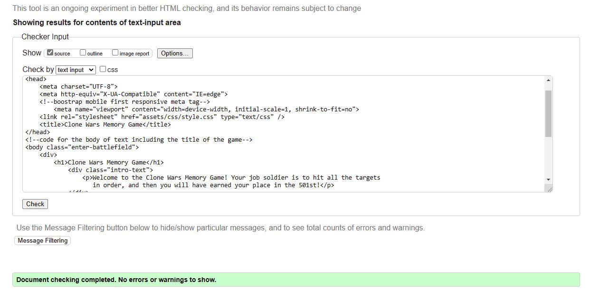

- Below is the validation for the Game page, No errors found
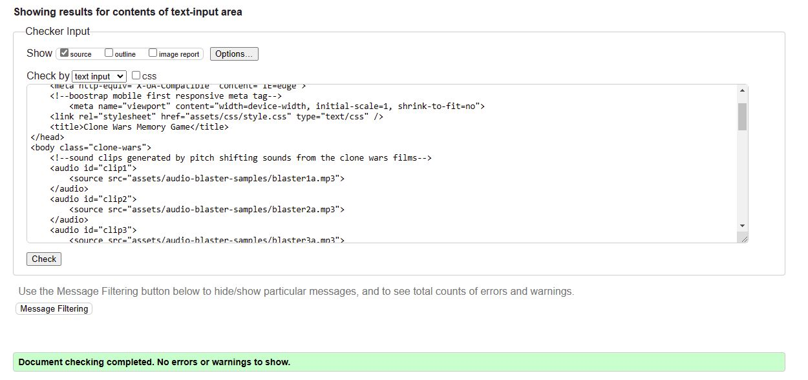

- Below is the validation for the Feedback Form page, No errors found
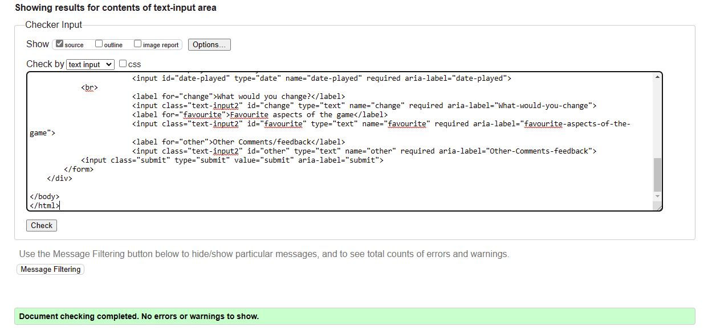

### CSS Validation

- Below is the validation for the CSS styling, No errors found
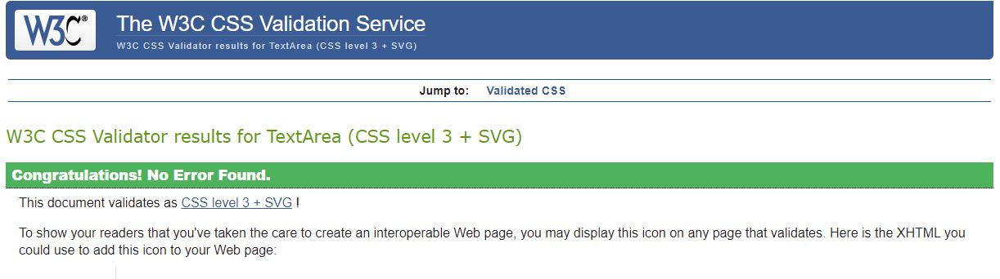

### Javascript Validation

Below is the test results from JSLint. Unfortunately there was 1 error that i could not resolve. Which is the unexpected 'let' on line 88:10. I treied to rewrite the code to avoid this error and including research was unable to clear this error. However in my research I found that many other users come across this issue, and unfortunately the few who have been able to fix this, when implementing their fixes, this did not get rid of the error.

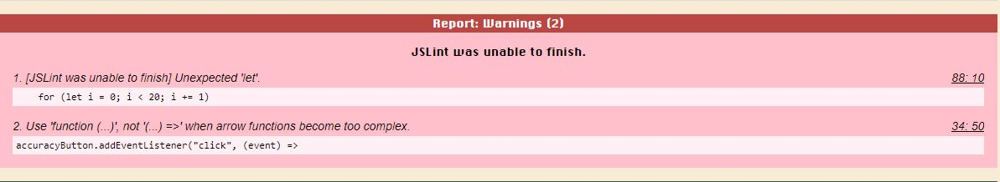

So, in an attempt to verify this result, I ran the javascript code through [JSHint](https://jshint.com/) and this uncovered no errors in the code shown in the picture below:

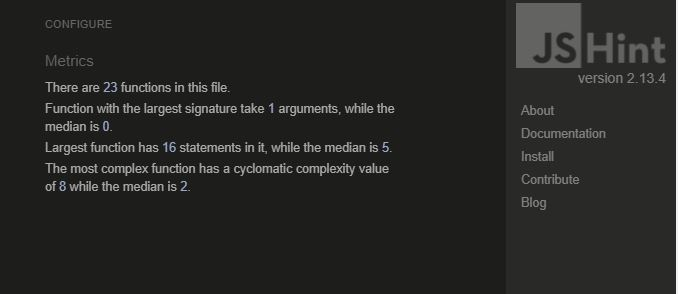

The next thing I did to test my javascript code was to conduct unit tests which are located in the test-JS-file called 'sum.test.js'

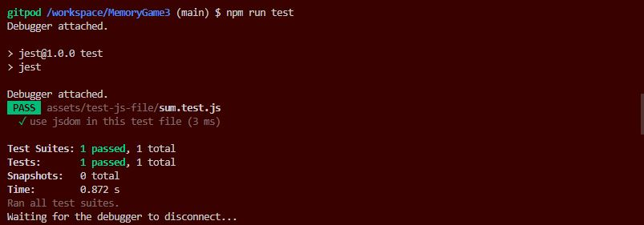

### Manual Testing

Test            | Outcome                          | Result
--------------- | -------------------------------- | ------------
Navigation Bar  | Does the nav bar navigate to each page?, and indicates with an underline what page you are on?, does it change color when hovering? | Pass (feedback form link also functions the same Pass)
Buttons | Does all buttons function as intended in game consistantly? Does the power button turn on the game? Does Accuracy button restart the game when a incorrect panel is clicked? | Pass
Links | Does every link take you to the intended destination? | Pass
Game User Story 1 | Is the user presented with an enter screen with instructions to the game | Pass
Game User Story 2 | Is the user presented with a random set of panel flashes? | Pass
Game User Story 3 | When the user inputs a sequence of panel clicks, does the user see this repeated with 1 more addition to the sequence? | Pass
Game User Story 4 | Does the user hear a sound for each panel and hear the correct sound when a panel is clicked. And this sound is related to star wars? | Pass
Game User Story 5 | If the user inputs the incorrect panel in the sequence, the game tells the user so and repeats the pattern so the user can try again? | Pass
Game User Story 6 | The user can clearly see how many clicks are in any given sequence? | Pass
Game User Story 7 | The user can play with accuracy button engaged, which when a incorrect panel is clicked the game notifies the user and restarts from the beginning of the game? | Pass
Game User Story 8 | Is the user notified if the user has Won the game? | Pass
Game | Does an alert box pop up to tell the user if the user has won/lost the game? | Pass
Game User Story 9 | I can give myfeedback/comments on what i think of the game? | Pass
Booking Form | Does the submit button work correctly? Does the form successfully submit data? Does the calendar work when icon is clicked | Pass

- Below is the conformation that the form works as intended and indeed will submit data.

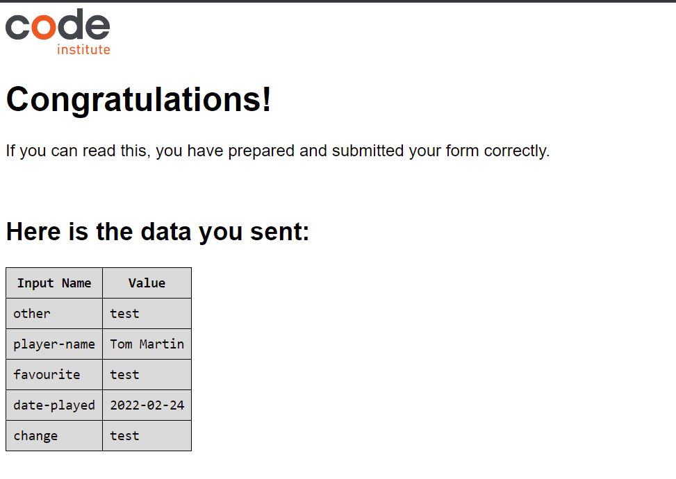

## Responsiveness Testing

I have carried out manual testing on the following devices to test responsiveness, all links worked correctly, and on all devices the game functions as intended. The devices were tested on the following:

* iphone 5
* iphone 6
* iphone 7
* iphone 8
* Google Pixel 5
* Ipad
* Tablets
* Laptops

- Below is the results from the responsiveness test ran on [Am I Responsive](http://ami.responsivedesign.is/#) which is also where this image was made.

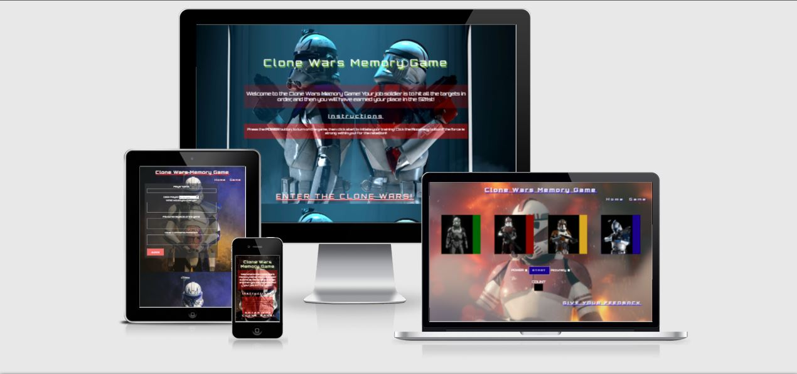

## 9. Bugs
[Go to the top](#table-of-contents)

## 10. Deployment
[Go to the top](#table-of-contents)

The site was deployed to GitHub following these steps:

* Create Github Account
* Create a new repository
* Click on settings on the navigation bar under the repository title
* Select pages on the left menu bar
* Click on the master branch and save
* This has now created the link to your live website
* Live website link - https://8stringking.github.io/MemoryGame3/

